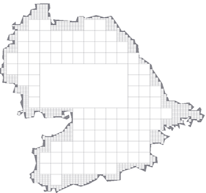
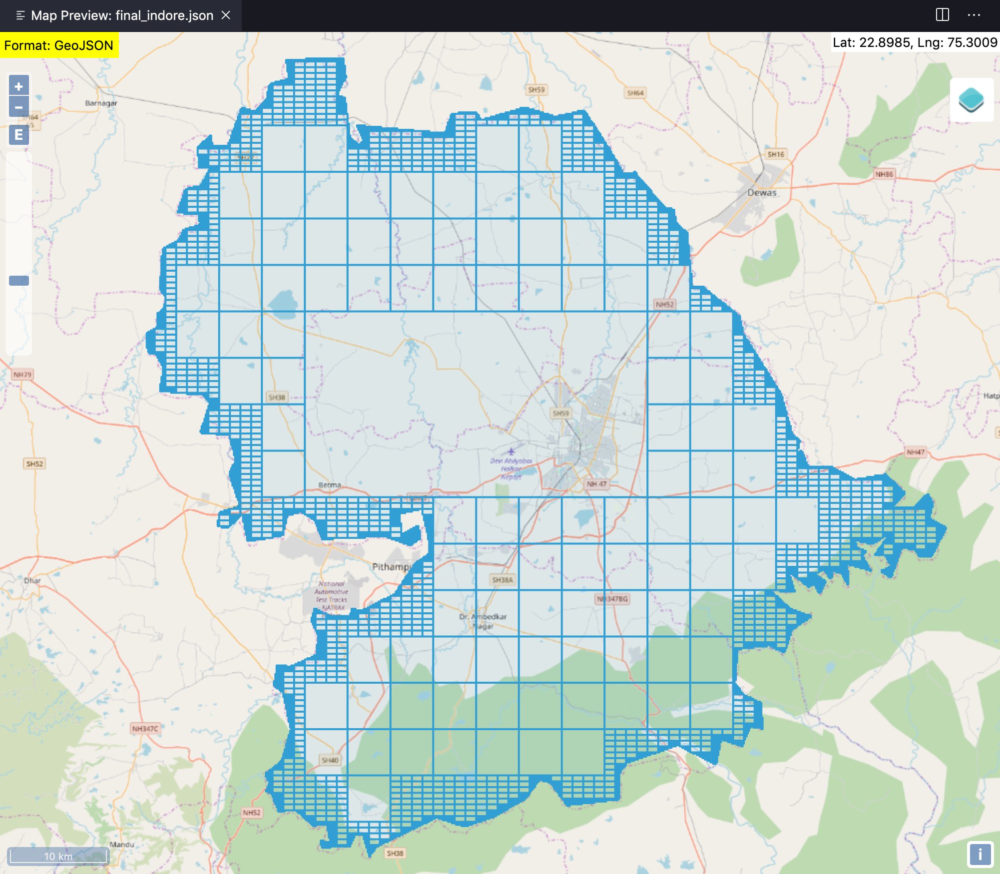

# geohash - compress
A data compression and [Geo-hasing](http://en.wikipedia.org/wiki/Geohash) library for large sized Geo-polygons. It solves the problem when standard point-in-polygon query takes too much time and conversion of Geo-polygon into Geohashes for constant time point-in-polygon query, takes large space in memory. This library provides a memory effiecent soltution for constant time point-in-polygon query by converting the hashes to lowest possible order.


## Installation
### In Node.js
``` sh
npm install geohash-compress 
```


### Run test locally

1. Clone this repo

``` html
https://github.com/raghav1408/geohash-compress.git
```

2. Install NPM packages

``` html
npm install
```

3. Run tests

``` html
npm run test
```


<!-- USAGE EXAMPLES -->
## Usage in Node.js example
```js
const geoHashCompress = require('geohash-compress');
// Geofence is array of {long,lat} of the geofence.
(async()=>{
    let geofence = [[
        [75.4375024, 22.8725924],
        [75.4401784, 22.9105034],
        [75.4562348, 22.9185316],
        [75.4620329, 22.9287898],
        [75.4375024, 22.8725924],
    ]]
    //construct a new polygon from the geofence
    const polygon = await new geoHashCompress(geofence,7); 
    
    // compress the polygon and returns a map with geohash as key eg: {tsj8p6n:true}
    polygon.compress(); 
    
    //polygon.insideOrOutside(long,lat) return true/false if point{long,lat} is inside/outside polygon.
    console.log(polygon.insideOrOutside(75.8814993,22.7418224)) 
    
    // returns compressed geometry as Geojson.
    const geojson = polygon.toGeoJson();
})()
 
```

## Benchmarks
```html
Intial data size of polygon : 34.8 MB
Final data size of polygon : 1.2 MB

100 point-in-polygon query without compression: 3ms
100 point-in-polygon query with compression: 4ms
```


*Without Compression 34.8 MB*                     ->               *With Compression 1.2 MB*
<!-- LICENSE -->
## License

Distributed under the Apache 2.0 License. See `LICENSE` for more information.


<!-- 
 -->
