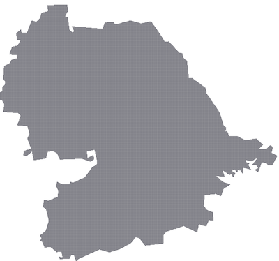

# geohash - compress
A data compression and [Geo-hasing](http://en.wikipedia.org/wiki/Geohash) library for large sized Geo-polygons. It solves the problem when standard point-in-polygon query takes too much time and conversion of Geo-polygon into Geohashes for constant time point-in-polygon query, takes large space in memory. This library provides a memory effiecent soltution for constant time point-in-polygon query by converting the hashes to lowest possible order.


## Installation
### In Node.js
``` sh
npm install geohash-compress 
```


### Download

1. Clone this repo

``` html
https://github.com/<your-username>/geohash-compress.git
```

2. Install NPM packages

``` html
npm install
```

3. Run tests

``` html
npm run test
```


<!-- USAGE EXAMPLES -->
## Usage in Node.js example
```js
const geoHashCompress = require('geoHashCompress');
const polygon = await new geoHashCompress([reverse2DArray(geoFenceIndore)],7);
let hashes = polygon.compress()); // returns a map with geohash as key
console.log(polygon.insideOrOutside(22.7418224,75.8814993)) // returns true if a point is inside the polygon.
const geojson = polygon.toGeoJson(); // returns compressed geometry as Geojson.
```

## Benchmarks
```html
Intial data size of polygon : 34.8 MB
Final data size of polygon : 1.2 MB

100 point-in-polygon query without compression: 3ms
100 point-in-polygon query with compression: 4ms
```


<div class="image123">
    <div style="float:centre;margin-right:5px;">
        
        <p style="text-align:center;">Without compression(34.8 MB)</p>
    </div>
    <div style="float:centre;margin-right:5px;">
        
        <p style="text-align:center;">Without compression(1.2 MB)</p>
    </div>
</div>


<!-- LICENSE -->
## License

Distributed under the Apache 2.0 License. See `LICENSE` for more information.


<!-- 
 -->
